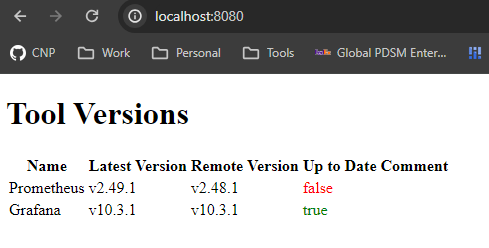

# Version Checker Application

## Overview

The Version Checker is a Go application designed to monitor and compare the versions of various tools against their latest available versions.
It utilizes a configuration file (`config.yaml`) to specify which tools to check, along with optional settings for fetch intervals, current versions,
and comments for each tool. The application periodically fetches the latest version data for these tools and serves a webpage displaying this information,
making it easy to see which tools are up to date and which need attention.

## Features

- **Periodic Version Check**: Automatically fetches tool version data at specified intervals.
- **Custom Configuration**: Supports overriding default settings for fetch intervals, current versions, and comments through `config.yaml`.
- **Web Interface**: Provides a web interface to view the current and latest versions of tools.

## Prerequisites

Before running the application, ensure you have the following installed:

- Go (if running locally)
- Docker (if running via Docker)

## Configuration - config.yaml

```yaml
fetchInterval: 10 # defined in minutes (Optional)
tools:
  # Example using a hardcoded version value
  - name: "Prometheus"
    latestVersionEndpoint: "https://api.github.com/repos/prometheus/prometheus/releases/latest"
    latestVersionJSONKey: "tag_name"
    currentVersion: "v2.48.1" # Optional
    comment: "Blocked by vulnerability in latest version." # Optional
  # Example using version via API
  - name: "Grafana"
    latestVersionEndpoint: "https://api.github.com/repos/grafana/grafana/releases/latest"
    latestVersionJSONKey: "tag_name"
    myVersionEndpoint: "https://api.github.com/repos/grafana/grafana/releases/latest"
    myVersionJSONKey: "tag_name"
```

| Field                   | Description                                                                                                                      |
| ----------------------- | -------------------------------------------------------------------------------------------------------------------------------- |
| `name`                  | Name of the tool.                                                                                                                |
| `latestVersionEndpoint` | URL to fetch the latest version.                                                                                                 |
| `latestVersionJSONKey`  | JSON field name that the tag exists in.                                                                                          |
| `myVersionEndpoint`     | The endpoint you want to check against the latest version.                                                                       |
| `myVersionJSONKey`      | JSON field name that the tag exists in.                                                                                          |
| `currentVersion`        | Current version of the tool being run. This is useful if you can't get to the endpoint and want to manually override (optional). |
| `fetchInterval`         | Interval to fetch the endpoints and refresh the frontend in minutes. Default is 10 minutes (optional).                           |
| `comment`               | A comment about the tool (optional).                                                                                             |

## Output / Frontend



## Running Locally

To run the application locally, follow these steps:

- Clone the repository and navigate to the project directory.
- Ensure config.yaml is in the root directory of the project.
  Run the application:

```bash
go run .
```

The server will start on port 8080. Access the web interface by navigating to http://localhost:8080 in your web browser.

## Running with Docker

The application is also available as a Docker image on DockerHub (jayw77/version-checker). To run it using Docker, follow these steps:

### Pull the Docker image:

`docker pull jayw77/version-checker:latest`

### Run the Docker container, ensuring to mount the directory containing your config.yaml to the container:

```bash
docker run -d -p 8080:8080 -v $(pwd):/app jayw77/version-checker:latest
```

Replace $(pwd) with the path to the directory containing your config.yaml file. The server will start on port 8080, and you can access the web interface as described above.
